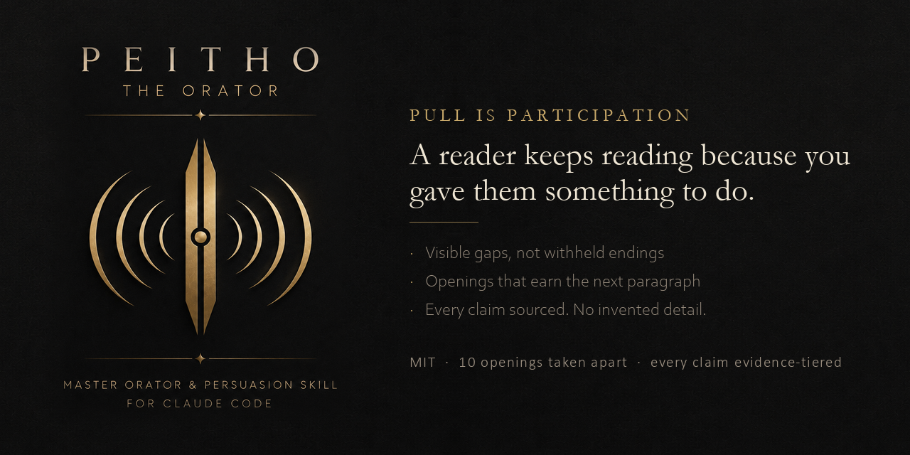

# Peitho



**A master orator and persuasion skill for Claude Code.**

Peitho makes prose pull a reader in and hold them there, end to end, without lying to them. Named for the Greek goddess of persuasion.

## The axiom

**Pull is participation.** A reader stays because you have given them something to do.

Aristotle built persuasion on the enthymeme, an argument that omits a premise so the audience supplies it. Loewenstein found in 1994 that curiosity requires a *visible* gap, and dies at both zero knowledge and complete knowledge. Heritage & Greatbatch analyzed 476 real political speeches and found seven rhetorical formats drew about 70% of all applause, every one of them a structure that opens a slot for the audience to close.

Two thousand three hundred years apart, three traditions on the same point. Withhold everything and there is no gap to see. Explain everything and there is no slot left.

## What it does

Governs prose at three levels:

- **Line.** Concreteness calibrated to an inverted U. Rhetorical figures welcome, at no comprehension cost. Complexity permitted.
- **Passage.** Every paragraph closes one gap and opens another. This is the hold engine.
- **Piece.** Three exordium jobs at the door. Tension arc as hygiene. Every gap closed by the end.

Openings get their own module, not because they are a separate discipline but because 55% of pageviews get under 15 seconds of attention, so that is where the same rules carry the most weight.

## What makes it unusual

**It contradicts most hook advice in circulation, with citations.** Five widely repeated rules are buried in `references/myths.md`, including "withhold the outcome to build suspense" (spoiled stories were enjoyed *more*, across three genres) and "follow the arc and readers will come" (roughly 40,000 narratives, no relationship to popularity).

**Every claim carries an evidence tier.** `[M]` meta-analytic, `[E]` single strong study, `[C]` correlational, `[L]` craft lore, `[?]` encountered secondhand and unverified. Lore is allowed. Lore dressed as science is not.

**The ethics rail is derived, not decorative.** Transported readers detect fewer flaws in what they read. The technique measurably lowers a reader's scrutiny, so the rail is part of the technique. Fabricating a concrete detail is a blocking rule, because concreteness is exactly what this skill rewards.

## Layout

| Path | Contents |
|---|---|
| `SKILL.md` | The procedure |
| `references/evidence.md` | The corpus, tiered and cited |
| `references/orators.md` | Real openings reverse-engineered. Read this to imitate rather than guess |
| `references/myths.md` | The buried advice |
| `references/ethics.md` | The honest-persuasion rail |
| `references/forms.md` | Exit speed and audience stance calibration |
| `references/scorecard.md` | The 0 to 5 rubric |
| `references/deslop.md` | Banned words, banned patterns, the em-dash law |
| `design.md` | Doc of record |

## Install

**As a plugin,** which keeps it updated in place:

```
/plugin marketplace add Pr1m4lc0d3/peitho
/plugin install peitho@peitho
```

**By hand:**

```bash
git clone https://github.com/Pr1m4lc0d3/peitho
cp -r peitho ~/.claude/skills/
```

`SKILL.md` and `references/` are the whole skill. Everything else in the repo is source material.

**For local development** there is `deploy-skill.ps1`, which stages and copies in one step. Pass
`-SkipDeploy` to validate without installing.

## Honest limits

Narrative persuasion effects are real and modest, around r = .17 to .23. No structural formula predicts success. Peitho is an engineered procedure assembled from evidenced components: the components are cited, the assembly is a construction.
