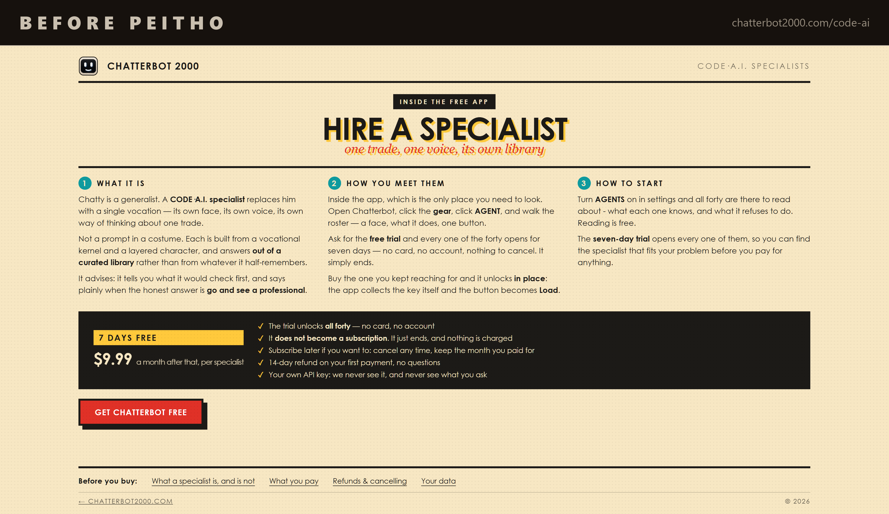
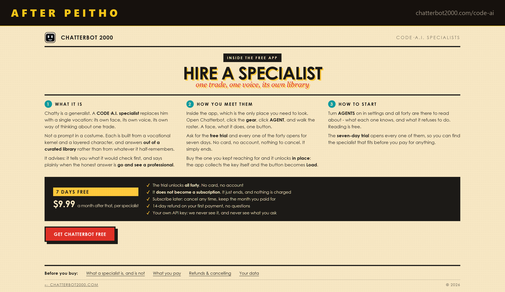

# Before and after

A live sales page, edited by Peitho on 2026-08-14. Nothing was restructured. No
section moved, no heading changed, no argument rewritten. This is the edit pass
only: the em-dash law, and the flab that a hedge leaves behind.

| | |
|---|---|
| Page | [chatterbot2000.com/code-ai](https://chatterbot2000.com/code-ai/) |
| Em-dashes on this page | 12 before, 0 after |
| Em-dashes across the four pages of the site | 20 before, 0 after |

## What changed, and why that mark

Peitho does not swap an em-dash for a shorter dash. It asks what the sentence was
actually doing and gives it the right mark.

**A period**, where the dash was welding two complete thoughts together.

> a face, what it does, one button → roster. **A face**, what it does, one button
> seven days — no card → seven days. **No card**, no account, nothing to cancel
> all forty — no card → all forty. **No card**, no account

**A colon**, where the clause genuinely defines what came before it.

> a single vocation — its own face → a single vocation**:** its own face, its own voice

**Parentheses**, for the one true aside on the page, inside the legal notice.

**Two cuts of flab** came out with them. "Subscribe later if you want to" hedges a
decision that was already the reader's. "The specialist that fits your problem"
became "the specialist that fits", because the problem is what the whole sentence
is about.

## The rule being enforced

Chat replies and anything under 500 words: zero. Longer prose: at most 2 per
1,000 words, never 2 in one paragraph. A period, colon, comma, semicolon or
parentheses is always available and almost always better.

The em-dash is the most reliable surface tell of machine-written prose. A page
carrying twelve of them reads as generated whether or not a human wrote it.
